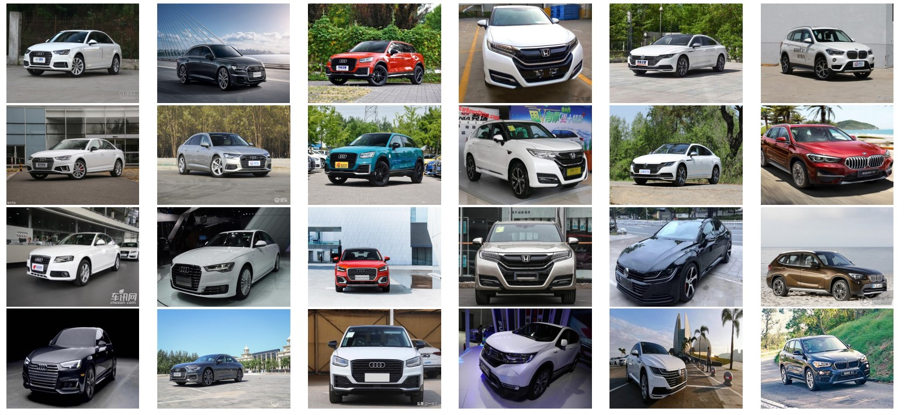

# Web-ReID: Unsupervised Vehicle Re-identification from Web Searches 

## Introduction 


Learning the discriminative feature representation for the unsupervised vehicle Re-ID task with the assistance of the web images auto-tagged with model keywords. The source code of the Web-Driven Clustering method for unsupervised vehicle re-identification.

## Installation 

### Requirements 

* Linux 
* CUDA 9.2 
* Python3
* Pytorch 1.1 

### Install 

1. Clone the repository.
```shell 
> git clone https://github.com/BravoLu/Web-Driven-Clustering.git 
> cd Web-Driven-Clustering
```

2. Create the env. 
```shell
> conda create -n wdc python=3.6
> source activate wdc 
> pip install -r requirements.txt 
```

## Train 
1. Download the datasets.
* [WebSearchVehicle(password: 3914)](https://pan.baidu.com/s/139eYU9tsp-0uVq8ojhKLdw) :We collect this dataset via [google-images-download](https://github.com/hardikvasa/google-images-download), and using faster-rcnn to get the cropped images.  

* [VeRi(password: 3914)](https://pan.baidu.com/s/1UDpV1pD5mN6g2hMLmVkZoA)

2. Link the dataset to ./datas
```shell
> ln -s path/to/WebSearchVehicle ./datas/WebSearchVehicle
> ln -s path/to/VeRi ./datas/VeRi
> ln -s path/to/VeRi-Wild ./datas/VeRi-Wild
```
3. Train the baseline.
```shell
python train.py --config baseline --gpu 0,1
```

4. Training using web-driven-clustering.
```shell
> python train.py --config web_driven_clustering --gpu 0,1 
```
## Test 
1. Download the [checkpoint files(password:3914)](https://pan.baidu.com/s/1BhxkbBNHRW1BdCoJeXiZjw). 

2. Test.
```shell
> python train.py --config web-driven-clustering -t --gpu 0,1 --ckpt /PATH/TO/CHECKPOINT
```

## Results 

* VeRi

|                       | mAP   | rank-1 | rank-5 | rank-10 |
| --------------------- | ----- | ------ | ------ | ------- |
| Baseline              | 20.1% | 61.9%  | 76.0%  | 82.0%   |
| Web-Driven-Clustering | 32.8% | 76.3%  | 85.1%  | 88.8%   |

